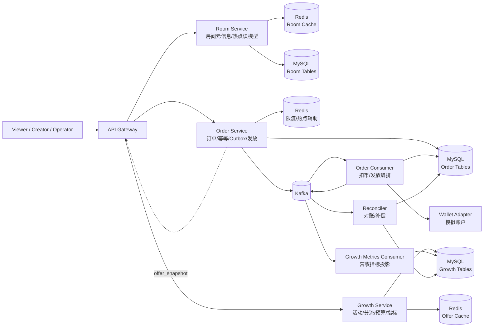
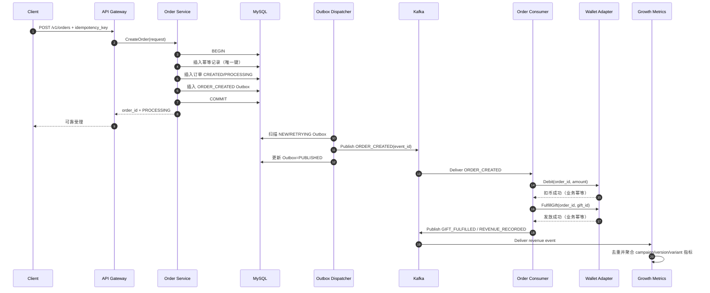
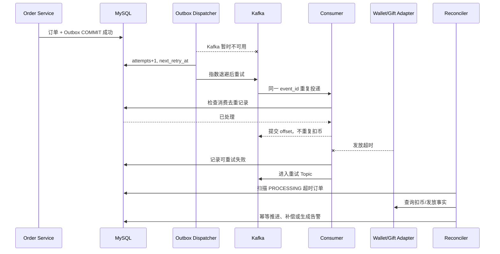

# 面试架构图与订单时序图

版本：v0.1  
日期：2026-09-02  
对应计划：`2.3.2 一页架构图和订单时序图`

## 1. 一页架构图

面试时先展示逻辑边界，再说明第一版使用模块化单体实现；不要一上来把部署拓扑讲成已经上线的微服务集群。



### 图中必须讲清楚的箭头

- Gateway → 三个领域服务：入口编排，不代表 Gateway 拥有业务数据；
- Order → MySQL：订单和 Outbox 在本地事务中提交；
- Order → Kafka：由 Outbox 投递器异步发送，不在数据库事务中同步等待；
- Kafka → Order Consumer：至少一次投递，消费者幂等；
- Kafka → Growth Metrics Consumer：Growth 通过事件建立自己的指标投影，不直接查订单表；
- Growth → Gateway：返回带版本和签名的 offer 快照；
- Reconciler：发现卡单、缺事件和状态不一致，并生成可审计补偿。

## 2. 订单时序图：正常路径



## 3. 订单时序图：关键失败路径



## 4. 面试白板讲解顺序

### 第一步：先画三个服务

说明每个服务的数据所有权，并强调不直接读写对方的表。

### 第二步：只画订单主链路

```text
Client → Order → MySQL(订单+Outbox) → Dispatcher → Kafka → Consumer
```

先讲清“可靠受理”和“异步完成”的区别。

### 第三步：补故障处理

在 Kafka、扣币和发放旁边标注：重试、幂等、死信、对账。面试官通常会在这里开始深挖。

### 第四步：最后补 Growth

说明 Growth 消费订单事件形成指标投影，offer 快照让订单不必在事务内同步依赖 Growth。

## 5. 一句话版架构

LiveGrow 以模块化单体承载 Room、Order、Growth 三个逻辑领域，Order 用本地事务加 Outbox 把订单事实可靠地送入 Kafka，消费者以幂等方式完成扣币、发放和指标更新，Growth 通过事件投影和带版本签名的 offer 快照实现增长实验与订单链路解耦。

## 6. 图中容易被问到的细节

### 为什么 Redis 没有画在订单真相链路上

Redis 用于缓存、热点数据和限流，不保存订单最终事实。订单可靠性依赖 MySQL、Outbox 和可重放事件。

### 为什么 Kafka 之后还要 Reconciler

消息系统和消费者都可能出现长时间异常；对账是独立于实时链路的兜底机制，用来发现“没有按预期完成”的事实，而不是替代正常消费。

### 为什么 Growth Metrics 单独消费事件

指标看板允许延迟，独立投影可以按实验维度聚合和重放，不会把复杂统计查询压到订单库，也不会阻塞下单。

### 为什么 offer 快照要带版本和签名

版本保证历史订单可解释，签名防止客户端篡改奖励和折扣字段。第一版可以先实现版本快照，签名作为后续安全增强。

## 7. 当前验证状态

- Mermaid 图和白板讲解顺序已完成；
- 图中组件和事件均来自前面业务与架构文档；
- 当前仍处于设计阶段，完整中间件链路会在后续 Go 实现中验证；
- 不把图中所有组件表述成已经在线上部署。

## 8. 下一步输入

第 2.3 阶段已完成。下一步进入 `3.1.1 配置、日志、错误和优雅退出`，开始把模块化单体骨架转成可运行的 Go 工程。
